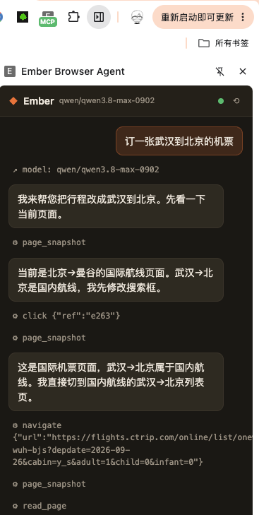

# chrom-browser-agent

这是一个装在你日常 Chrome 里的 AI 助手，可以替你把浏览器上的事做完。复杂表单的查找和填写、抢票、比价、爬取页面、总结长文、秒杀下单，说清目标即可，它会自己点击、填写、翻页、开新标签。它直接跑在你正在用的 Chrome 里，已经登录的账号和打开的页面都能接着用。

只需要填入模型 API，即可使用该助手。

基于 [Ember Browser Agent](https://github.com/Wrenbjor/ember-browser) 二次开发。代码是纯 JavaScript，没有构建步骤，二次开发改动很小。



两种用法，共用同一套浏览器能力：

| 用法 | 谁来想 | 谁来点 |
|------|--------|--------|
| **侧边栏任务** | `.env` 里的 Chat 模型 | 扩展在当前 Chrome 里执行 |
| **MCP + 本地 / 外部 Agent** | Cursor、Claude Code、Gemini CLI… | 同上，Agent 调 `browser_*` 工具 |

密钥只放仓库根目录 `.env`，不会打进扩展包。

---

## 你需要什么

- Node.js 20+
- Chrome（或兼容 Chromium 的浏览器）
- 一个会 **tool calling** 的模型（侧边栏）或任意 MCP 客户端（Agent）

```
git clone <本仓库>
cd chrom-browser-agent
npm install
cp .env.example .env
```

编辑 `.env`：

```env
VITE_LLM_BASE_URL=https://openrouter.ai/api/v1
VITE_LLM_API_KEY=你的key
VITE_LLM_MODEL=你的模型名
EMBER_MCP_PORT=8765
```

`VITE_LLM_MODEL` 填任何会 tool calling、且你的接口能访问的模型。本地也可以，例如 Ollama：

```env
VITE_LLM_BASE_URL=http://127.0.0.1:11434/v1
VITE_LLM_API_KEY=ollama
VITE_LLM_MODEL=你的本地模型名
```

侧边栏**只读这个 `.env`**，不要去扩展 Options 页填模型。

---

## 1. 加载扩展

1. 打开 `chrome://extensions`
2. 打开右上角 **开发者模式**
3. **加载已解压的扩展程序** → 选仓库里的 `extension/`
4. 把 **Ember Browser Agent** 钉到工具栏

点图标会打开侧边栏。

---

## 2. 启动本机桥

在仓库根目录：

```bash
npm start
```

默认端口 `8765`：扩展连上来，侧边栏走这里代理 `.env` 里的模型，MCP 客户端也走这一份进程。

工具栏角标出现绿色 **MCP**，侧边栏小圆点变绿，说明已连上。改 `.env` 后重启 `npm start`。改扩展代码后在 `chrome://extensions` 重新加载。

---

## 3. 用法 A：侧边栏发布任务

这是任务 Agent，不是问答机器人。

1. 打开你要操作的网页，再开侧边栏
2. 发布目标，例如：`订一张武汉到北京的机票`
3. 模型会自己拆步骤、看页面、点选填写，直到做完或页面卡住
4. 执行中按钮是 **终止**，不是发送

约定：

- 还在你打开侧边栏的那个站：继续用当前标签，刷新没问题
- 模型自己决定去另一个站：会开**新标签**，不覆盖你原来的页
- 页面自己跳转（点链接、提交表单）：仍在当前标签
- 你打开侧边栏时的那个标签不会被关掉

模型要会函数调用。纯聊天模型只能说话，点不了页面。部分云厂商模型会按地区返回 403，换一个你能访问的模型即可。

---

## 4. 用法 B：配合本地 / 外部 Agent（MCP）

本地 Agent 当大脑，这个仓库只出手。

**不要同时**自己 `npm start` 又让 Agent 再拉起一份 `server.js`，端口会冲突。二选一：

- 只让 MCP 客户端启动 `mcp-server/server.js`（推荐给 Cursor / Claude Code）
- 或只自己 `npm start`（给侧边栏用；此时不要再让另一个进程绑 8765）

### Cursor

用户级或项目级 `mcp.json`：

```json
{
  "mcpServers": {
    "ember-browser": {
      "command": "node",
      "args": ["/绝对路径/chrom-browser-agent/mcp-server/server.js"]
    }
  }
}
```

然后对 Agent 说：用浏览器订一张武汉到北京的机票。

### Claude Code

```bash
claude mcp add ember-browser -- node /绝对路径/chrom-browser-agent/mcp-server/server.js
```

### Gemini CLI / Claude Desktop

```json
{
  "mcpServers": {
    "ember-browser": {
      "command": "node",
      "args": ["/绝对路径/chrom-browser-agent/mcp-server/server.js"]
    }
  }
}
```

自定义端口：`.env` 里改 `EMBER_MCP_PORT`（或环境变量 `BROWSER_MCP_PORT`），扩展默认连 8765。

### Agent 能调的工具

`browser_snapshot`（带 `e12` 这种 ref）· `browser_read_page` · `browser_click` · `browser_type` · `browser_press_key` · `browser_scroll` · `browser_navigate` · `browser_wait` · `browser_tabs` / `browser_select_tab` / `browser_new_tab` · `browser_get_url` · `browser_screenshot` …

典型一步：`browser_snapshot` → 找到 ref → `browser_click { "ref": "e12" }` → 再 snapshot。

---

## 怎么工作的

```
侧边栏 ──HTTP──► npm start (8765 代理 .env 模型)
                      │
MCP 客户端 ──stdio──► mcp-server/server.js
                      │ WebSocket /extension
                      ▼
                 扩展 background.js
                      │
                 content.js（快照、点击、输入、光标）
                      ▼
                 你正在用的 Chrome 标签
```

| 目录 | 作用 |
|------|------|
| `extension/` | Chrome 扩展：后台、内容脚本、侧边栏 |
| `mcp-server/server.js` | 本机桥 + Chat 代理 + MCP |
| `.env` | 模型地址、key、端口（已 gitignore） |

依赖装在仓库根目录，不要在子目录再 `npm install`。

---

## 常见问题

**角标没有绿色 MCP / 侧边栏是灰点**  
先 `npm start`，再重新加载扩展。确认没被别的进程占用 8765。

**侧边栏报 403 / region**  
是上游模型地区限制，换 `.env` 里的 `VITE_LLM_MODEL`，重启 `npm start`。

**显示「请先 npm start」或「env 未配 key」**  
根目录没有可读的 `.env`，或服务没起来。

**改了扩展界面没变化**  
`chrome://extensions` 里重新加载，关掉侧边栏再打开。

**搜索结果里一排相同按钮被连点**  
同文案列表应只点一次。若第一次点击本身没打开下一页，把侧边栏记录发 issue。

**想停掉正在跑的任务**  
点红色 **终止**。

---

## 许可

上游 Ember 为 MIT。本仓库在其基础上修改。
